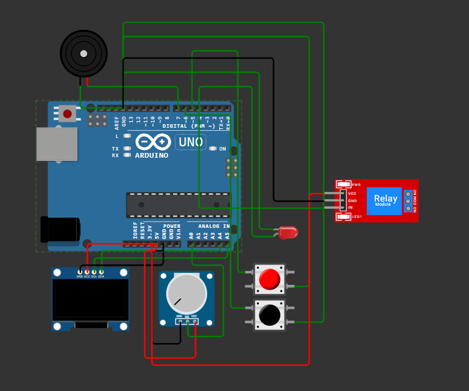

Screenshot 2025-09-01 201059.png

# 🌱 AGROSMART – PROTOTYPE 1  
**Smart Water Sprinkler System**

---

## 📸 Project Image  
  
*(Replace with actual wiring diagram or prototype photo)*  

---

## 📖 Project Overview  
AGROSMART is an **Arduino-based smart water sprinkler system** with a **user interface on an OLED screen**. It allows you to control a water sprinkler (represented by an LED) using a **rotary potentiometer for navigation** and **push buttons for selection**.  

The system features three main modes:  
- **Auto Spray**  
- **Eco Mode**  
- **Shutdown**  

---

## ⚙️ Features  

- **OLED Display**: A 128x32 pixel OLED screen (SSD1306) shows the menu, settings, and status messages.  
- **Menu-Driven Interface**: Navigate through modes using a rotary potentiometer.  
- **User Controls**:  
  - Potentiometer → scroll through menu options & adjust values.  
  - SELECT button → enter/confirm selections.  
  - BACK button → return to the main menu.  
- **Audio Feedback**: Buzzer provides tones for button presses & mode changes.  

---

## 🚀 Operating Modes  

### 1. Auto Spray  
- Set custom **WAIT Time** (minutes).  
- Set custom **SPRAY Time** (minutes).  
- System waits, sprays for set time, then returns to menu.  

### 2. Eco Mode  
- Automatically sprays for **1 minute every 10 minutes**.  
- Runs in the background until **BACK button** is pressed.  

### 3. Shutdown  
- Disables all sprinkler functions.  
- LED turns off.  
- Exit with BACK button.  

---

## 🛠️ Components  

- Arduino Board (Uno/Nano)  
- OLED Display (SSD1306, 128x32 I2C)  
- Potentiometer  
- SELECT & BACK Push Buttons  
- Buzzer (active/passive)  
- LED (simulating sprinkler)  
- Jumper Wires & Breadboard  

---

## 🔌 Wiring Diagram  

| Component        | Pin on Arduino | Description |
|------------------|----------------|-------------|
| OLED Display     | A5 (SCL), A4 (SDA) | I2C pins |
| Potentiometer    | A0 | Analog input for menu navigation |
| LED              | 4  | Output for sprinkler simulation |
| SELECT Button    | 5  | Digital input with internal pull-up |
| BACK Button      | 6  | Digital input with internal pull-up |
| Buzzer           | 7  | Digital output for tones |

---

## 💻 How to Use  

1. **Upload Code** via Arduino IDE.  
2. On startup → OLED shows *“Water Sprinkler”* → *“Starting...”*.  
3. Navigate with **Potentiometer** & select with **Buttons**.  
4. Modes:  
   - Auto Spray → set Wait & Spray times.  
   - Eco Mode → sprays 1 min / 10 min.  
   - Shutdown → sprinkler off.  

---

## 💡 Code Overview  

- **setup()** → initializes OLED, pins, and startup message.  
- **loop()** → checks current mode & runs handler functions.  
- **showMainMenu()** → draws main menu on OLED.  
- **handleMenuNavigation()** → updates menu index based on potentiometer.  
- **handleSubMenu()** → executes logic for selected mode.  
- **autoSprayMenu()** → lets user set wait & spray times.  
- **ecoModeMenu()** → manages timed spraying.  
- **shutdownMenu()** → disables sprinkler.  
- **sprayWater(durationMinutes)** → turns LED on/off for given duration.  
- **beep(f, d)** → generates buzzer tone.  

---
a given frequency (f) and duration (d).
